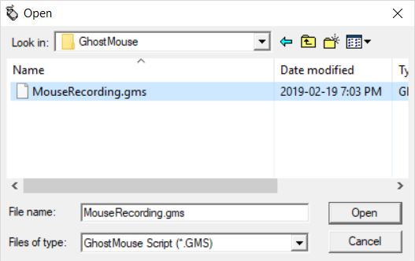

# GhostMouse
Version: GhostMouse 2.0 

Here is an inline {:height="36px" width="36px"}.

GhostMouse is a lightweight program that allows you to record your mouse mouvement and clicks and plays them back. 
You have the option to either do 1 playback, or infinite Loop by Clicking Play while recording.

# Hotkeys
| Hotkeys | Description |
| --- | --- |
| Ctrl + N | New File |
| Ctrl + O | Open File |
| Ctrl + S | Save File |
| Ctrl + Alt | Pause Playback |

# Credits
1997 Clarence Donath  
Arcadia Software 
http://www2.pcix.com/~donath 
donath@mail.idt.net or ac633@osfn.rhilinet.gov 
